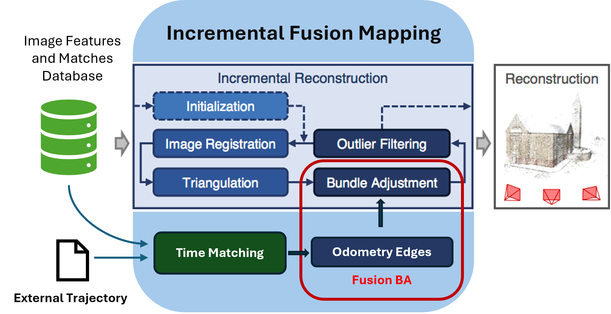
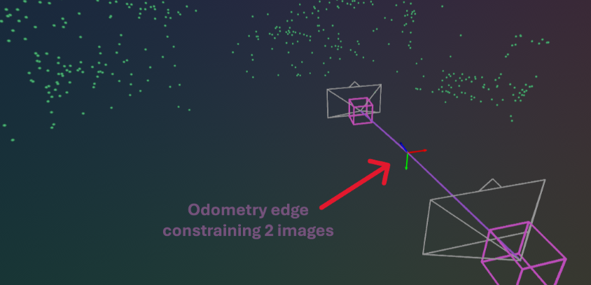
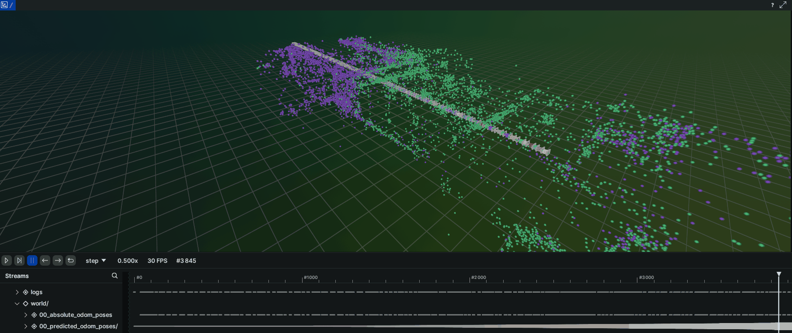
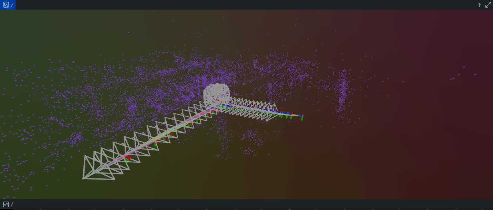
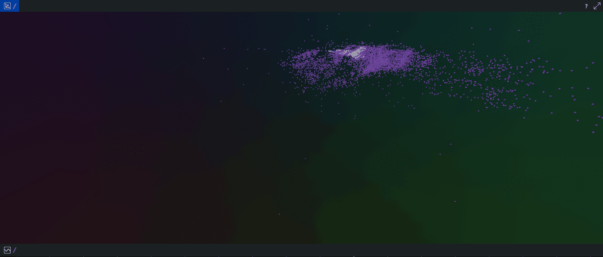

# Colmap Fusion Framework (Fuma)

COLMAP **3D reconstruction** **fused** with additional senor modalities (e.g. **external odometry**). **Structure-from-Motion** revisited; This time with more sensors and under the **factor graph formalism**.

<!--  -->
<p align="center">

</p>

> [!WARNING]
> This repo is still under heavy maintenance. Do not expect any warranty for usability, correctness, or code quality.

## Overview

This repo is a prototyping platform that enhances COLMAP's (vision-only) incremental mapping process with measurement factors from other sensors. Specifically, demos for fusing relative pose factors from external odometry are implemented. Integration of other modalities (e.g. IMU pre-integration) is easily done, when following the instructions of this repo.
<p align="center">
  <span style="background-color: white; padding: 10px; display: inline-block; border-radius: 8px;">
   
</p>

* Figure 1: Pipeline overview of this works implemented incremental fusion mapping system. This overview was adapted from the original concept figure of the [COLMAP](https://github.com/colmap/colmap) framework ~ (Schönberger & Frahm, "Structure-from-Motion Revisited," CVPR 2016).

This platform was developed as part of my Master's Thesis, supervised by [‪Prof. Dr. Guillermo Gallego‬](https://scholar.google.com/citations?user=v0_XxF0AAAAJ&hl=en) and conducted at [Expleo](https://expleo.com/global/de/branchen/automotive/#overview) Germany's <u>[ADAS department](https://expleo.com/global/en/insights/campaigns/autonomous-driving-adas/)</u> in Berlin. Main objective was a generalizable framework to easily obtain metric-scale (SfM) maps in which our demonstrator vehicle can re-localize itself using only a monocular camera. Speaking about vehicles and sensors, check out our awesome <u>[demonstrator vehicle](https://expleo.com/global/en/case-studies/automated-valet-parking/)</u>, which has been utilized to prototype and showcase many exciting applications in the domain of ADAS and AD.

## Table of Contents

- [Colmap Fusion Framework (Fuma)](#colmap-fusion-framework-fuma)
  - [Overview](#overview)
  - [Table of Contents](#table-of-contents)
  - [Features](#features)
    - [Variety of SfM and Fusion Helpers - Visualization and Ceres Stuff](#variety-of-sfm-and-fusion-helpers---visualization-and-ceres-stuff)
    - [High Level Fusion](#high-level-fusion)
    - [Tightly-coupled Fusion (Incremental Fusion Mapping)](#tightly-coupled-fusion-incremental-fusion-mapping)
    - [Samples for better understanding COLMAP's default reconstruction process](#samples-for-better-understanding-colmaps-default-reconstruction-process)
    - [Handy Scripts for Evaluation and Data Processing - Mix and Match](#handy-scripts-for-evaluation-and-data-processing---mix-and-match)
  - [Build](#build)
    - [Dependencies and prerequisites](#dependencies-and-prerequisites)
    - [Build instructions](#build-instructions)
  - [Usage and Samples](#usage-and-samples)
    - [High level fusion with external odometry](#high-level-fusion-with-external-odometry)
    - [Tightly-coupled Fusion with external odometry](#tightly-coupled-fusion-with-external-odometry)
    - [Visualize the samples with Rerun Viewer](#visualize-the-samples-with-rerun-viewer)
  - [Open Issues](#open-issues)
  - [Acknowledgments and License](#acknowledgments-and-license)

## Features

### Variety of SfM and Fusion Helpers - Visualization and Ceres Stuff

Helper modules used for both high level and tightly-coupled fusion.

1. **Custom Rerun SfM Logger class** -> [include/fusion_helper/rr_sfm_logger.h](include/fusion_helper/rr_sfm_logger.h):
   * Stream your COLMAP model (cam poses and 3d points) directly to your rerun viewer
   * Visualizes the odometry edges between your camera poses during fusion 
   * Deploy the logger into COLMAP's incremental reconstruction to see whats happening in between mapping 
2. **Ceres iteration callbacks** -> [include/fusion_helper/fusion_iteration_callback.h](include/fusion_helper/fusion_iteration_callback.h):
   * Stream your COLMAP model's bundle adjustment process directly to rerun viewer
   * Highlight local and global BA during default incremental reconstruction in the rerun viewer
   * Stream the fusion local and global BA (both high-level and tightly-coupled) to rerun viewer
3. **A variety of cost functions** -> [include/fusion_helper/cost_functions.h](include/fusion_helper/cost_functions.h)
   * Covariance weighted re-projection error
   * Scale-aware relative pose factor (7-DoF)
   * Highly experimental extrinsic calibration cost factor

### High Level Fusion

Originally used for familiarization with Ceres cost function concepts. Details under:

* <u>[High Level Fusion Module Description](docs/module_high_lvl_fusion.md)</u>

Fusion of fully reconstructed COLMAP models with relative pose constraints from corresponding external odometry data. Watch your unscaled COLMAP model grow to the true real-world scale through the fusion Bundle Adjustment process on your finalized model.

<p align="center">

</p>

<p align="center">

</p>

### Tightly-coupled Fusion (Incremental Fusion Mapping)
>
> [!IMPORTANT]
> Pay attention, this is the star of this repo!

Incremental Fusion Mapping (FUMA) as main contribution of my master-thesis. Details under:

* <u>[Tightly Coupled Fusion Module Description](docs/module_tightly_coupled_fusion.md)</u>

Fusion of relative pose constraints from external odometry data during COLMAP's active incremental mapping process:

<p align="center">
  
</p>

<p align="center">
  
</p>

### Samples for better understanding COLMAP's default reconstruction process

Check the binaries in description of [docs/module_tightly_coupled_fusion.md](docs/module_tightly_coupled_fusion.md) to:

1. See what's happening in your vanilla incremental reconstruction through visualization during reconstruction in rerun.
2. Understand COLMAP's internal vanilla reconstruction steps through nice code samples and additional explanations.

### Handy Scripts for Evaluation and Data Processing - Mix and Match
>
> [!WARNING]
> Following python helper scripts are not wrapped in any packaging/env that takes care of resolving dependencies so for now it's just copy-paste of functionality you might need.

1. Multi-project auto Reconstruction Pipeline (default COLMAP models)
   * Automatically reconstruct COLMAP models for independent COLMAP projects (e.g. same image dataset under different conditions) at once -> [scripts/multi_project_auto_sfm_pipeline](scripts/multi_project_auto_sfm_pipeline)
1. Export cam poses in COLMAP model as tum trajectory (requires imgs name to be nsec timestamp before reconstruction) -> [scripts/to_tum.py](scripts/to_tum.py)
1. Prepare public dataset images for COLMAP reconstruction
   1. KITTI -> [scripts/dataset_processing/kitti_rename_imgs_to_stamped.py](scripts/dataset_processing/kitti_rename_imgs_to_stamped.py)
   2. TUM4Seasons -> [scripts/dataset_processing/4seasons_result_to_tum.py](scripts/dataset_processing/4seasons_result_to_tum.py)

## Build

### Dependencies and prerequisites

Build process is only tested on Ubuntu 20.04.

* colmap 3.11.1 (will be cloned and build automatically by this repo)
* rerun_sdk 0.22.0 (c++)
* rerun_viewer 0.22.0 (pip or rust)

Except for the rerun_viewer, cloning and building these 3rd party packages are handled automatically by the main library cmake configuration.

### Build instructions

Make sure to apt install all colmap dependencies, listed here: <https://colmap.github.io/install.html#debian-ubuntu> (do not install COLMAP itself)

* Clone this repo
* On toplevel root dir of cloned repo, create a build directory, source the cmake config and execute make.

```bash
mkdir build && cd build  # at root level of this repo
cmake ..  # will exit early during first time cmaking to focus on the 3rd party dependencies
make -j4
```

> [!NOTE]
> Everything is fetched and installed locally (awesome)! Running `cmake ..` and `make` for the first time will fetch, build, and locally install the 3rd party repos (COLMAP + rerun SDK) automatically. Do not worry about stray install paths polluting your system; 3rd party build and install paths are scoped within this repo.

* If colmap decides to abort its build process in the middle, try `make` again .<br>

* After the 3rd party packages are build, `cmake ..` and `make` again for a 2nd time:

```bash
cmake ..  # again from build directory of main repo
make -j4
```

* This builds the main `colmap-fusion-framework` library. Links to 3rd party dependencies are resolved automatically, no need to adjust any paths unless you want to point to your own custom build comlmap version.

* Finally, `apt install` the `rerun_viewer` dependencies listed here: <https://rerun.io/docs/getting-started/troubleshooting#running-on-linux> and <https://rerun.io/docs/getting-started/troubleshooting#wsl2> for a wsl2 setup.

* Afterwards, pip install the `rerun viewer` through the rerun python sdk.

```bash
pip3 install --upgrade pip  # upgrade pip to find rerun python sdk for ubuntu 20.04
source ~/.bashrc  # source your bash after upgrading pip
pip3 install rerun-sdk==0.22.0  # rerun viewer is bundled in the python rerun-sdk
```

## Usage and Samples

Before running the executables for awesome fusion-aided 3D reconstruction, you need to prepare your default COLMAP database and external odometry tum file as described in [prepare-your-own-data](#prepare-your-own-data).

> [!TIP]
> Prerequisites
>
> * [Prepare your own data](docs/how-to-prepare-own-data.md) before usage.
> * Check [how-to-rerun-viewer.md](how-to-rerun-viewer.md) to open rr viewer before mapping to visualize the samples below.
> * Navigate to `$REPO_DIR/build/src/tightly_coupled_fusion/` to run tcf executables.
> * Check [Fusion mapping CLI args](how-to-cli-options.md) for more details on the cli args

### High level fusion with external odometry

Check the module description:

* [docs/module_high_lvl_fusion.md](docs/module_high_lvl_fusion.md)

### Tightly-coupled Fusion with external odometry

Check the module description:

* [docs/module_tightly_coupled_fusion.md](docs/module_tightly_coupled_fusion.md)

### Visualize the samples with Rerun Viewer

1. [docs/how-to-rerun-viewer.md](docs/how-to-rerun-viewer.md)

## Open Issues

1. Reconstruction quality and filtering
   1. Test different quality presets for OptionsManager
   2. Validated filtering of 3d points with reconstruction bounding box

2. Rerun
   1. 3d points cropping bounding box needs to update during iter callbacks in high level fusion otherwise growing models will loose all points
   2. Insert pngs into pinhole plane
   3. color extraction
   4. add rerun graph view

3. Fusion Iteration Callback
   1. Merge marathon and vanilla fusion iter class

4. Cost logging
   1. Find a way to wrap loss function around cost in ResidualCostTracker
   2. Add residual tracking to tcf
   3. Eventually remove ceres_eval_utils completely, once newer ResidualCostTracker is validated to all use cases.

5. Incremental fusion mapper
   1. create superset of mapping options to control actions that belong to mapper and not to FusionBA object
   2. PCA alginment options is task of mapper

## Acknowledgments and License
This project extensively relies on [COLMAP](https://github.com/colmap/colmap), [Ceres](http://ceres-solver.org/) and [Rerun](https://rerun.io/). Many thanks to the awesome work of the original contributors. Please see `3rd party license` below for more info.

* [LICENSE](LICENSE)
* [3rd party licenses](THIRD_PARTY_LICENSES.md)
